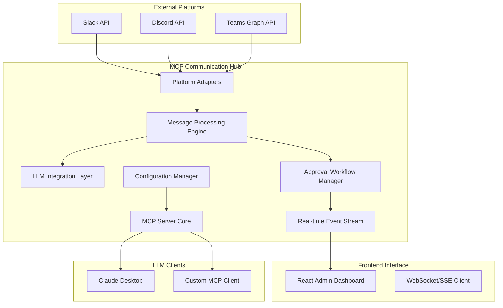

# Technical Architecture Plan: MCP-Powered Unified Communication Hub

## Executive Summary

This comprehensive technical specification outlines the architecture for building a unified communication hub using the mcp-go framework, integrating Slack, Microsoft Teams, and Discord with LLM-powered message analysis and human approval workflows. The system serves as an MCP server that provides intelligent communication capabilities to LLM clients while maintaining security, scalability, and real-time responsiveness.

## 1. System Architecture Overview

### 1.1 High-Level Architecture



### 1.2 Core Components

**MCP Server Layer**: Built using mcp-go framework, providing standardized tool, resource, and prompt interfaces to LLM clients.

**Platform Integration Layer**: Unified adapters for Slack (Bolt SDK), Discord (discordgo), and Teams (Graph API) with consistent message handling.

**Real-time Communication**: WebSocket/SSE infrastructure connecting Go backend to React frontend for live event streaming and approval workflows.

**LLM Processing Engine**: Concurrent message analysis using OpenAI API or local Ollama instances with intelligent response generation.

**Human Approval System**: Event-driven workflow requiring human authorization before executing certain actions across platforms.

## 2. MCP Server Implementation Architecture

### 2.1 Core MCP Server Structure

```go
package main

import (
    "context"
    "github.com/mark3labs/mcp-go/mcp"
    "github.com/mark3labs/mcp-go/server"
)

type CommunicationHub struct {
    mcpServer      *server.MCPServer
    platformMgr    *PlatformManager
    llmClient      *LLMClient
    approvalMgr    *ApprovalManager
    eventStream    *EventStream
    configMgr      *ConfigManager
}

func NewCommunicationHub(config *Config) *CommunicationHub {
    // Initialize with comprehensive capabilities
    mcpServer := server.NewMCPServer(
        "Communication Hub", "1.0.0",
        server.WithToolCapabilities(true),
        server.WithResourceCapabilities(true),
        server.WithPromptCapabilities(true),
        server.WithRecovery(),
        server.WithHooks(createAuthHooks()),
    )
    
    hub := &CommunicationHub{
        mcpServer:   mcpServer,
        platformMgr: NewPlatformManager(config),
        llmClient:   NewLLMClient(config.LLM),
        approvalMgr: NewApprovalManager(),
        eventStream: NewEventStream(),
        configMgr:   NewConfigManager(config),
    }
    
    hub.registerTools()
    hub.registerResources()
    hub.registerPrompts()
    
    return hub
}
```

### 2.2 MCP Tool Definitions

**Message Analysis Tool**:
```go
func (ch *CommunicationHub) registerTools() {
    // Message analysis tool
    analyzeMessageTool := mcp.NewTool("analyze_message",
        mcp.WithDescription("Analyze message content and suggest responses"),
        mcp.WithString("platform", mcp.Required(), 
            mcp.Enum("slack", "discord", "teams")),
        mcp.WithString("message_content", mcp.Required()),
        mcp.WithString("context", mcp.Optional()),
        mcp.WithString("user_id", mcp.Required()),
    )
    
    ch.mcpServer.AddTool(analyzeMessageTool, ch.handleAnalyzeMessage)
    
    // Send message tool with approval
    sendMessageTool := mcp.NewTool("send_message",
        mcp.WithDescription("Send message to communication platform"),
        mcp.WithString("platform", mcp.Required(), 
            mcp.Enum("slack", "discord", "teams")),
        mcp.WithString("channel_id", mcp.Required()),
        mcp.WithString("content", mcp.Required()),
        mcp.WithBoolean("require_approval", mcp.Optional()),
    )
    
    ch.mcpServer.AddTool(sendMessageTool, ch.handleSendMessage)
    
    // Bulk message analysis
    bulkAnalyzeTool := mcp.NewTool("bulk_analyze_messages",
        mcp.WithDescription("Analyze multiple messages for patterns"),
        mcp.WithString("platform", mcp.Required()),
        mcp.WithArray("message_ids", mcp.Required()),
        mcp.WithString("analysis_type", mcp.Optional(), 
            mcp.Enum("sentiment", "topics", "urgency", "compliance")),
    )
    
    ch.mcpServer.AddTool(bulkAnalyzeTool, ch.handleBulkAnalyze)
}
```

### 2.3 Resource Management

**Dynamic Platform Resources**:
```go
func (ch *CommunicationHub) registerResources() {
    // Channel list template
    channelTemplate := mcp.NewResourceTemplate(
        "channels://{platform}/{guild_id?}",
        "Platform Channel List",
        mcp.WithTemplateDescription("List of channels for specified platform"),
        mcp.WithTemplateMIMEType("application/json"),
    )
    
    ch.mcpServer.AddResourceTemplate(channelTemplate, ch.handleChannelResource)
    
    // Message history template
    messageTemplate := mcp.NewResourceTemplate(
        "messages://{platform}/{channel_id}",
        "Message History",
        mcp.WithTemplateDescription("Recent message history for channel"),
        mcp.WithTemplateMIMEType("application/json"),
    )
    
    ch.mcpServer.AddResourceTemplate(messageTemplate, ch.handleMessageHistory)
    
    // Platform status resource
    statusResource := mcp.NewResource(
        "status://platforms", "Platform Status",
        mcp.WithResourceDescription("Current status of all integrated platforms"),
        mcp.WithMIMEType("application/json"),
    )
    
    ch.mcpServer.AddResource(statusResource, ch.handlePlatformStatus)
}
```

## 3. Platform Integration Specifications

### 3.1 Unified Platform Adapter Interface

```go
type PlatformAdapter interface {
    Connect(ctx context.Context, config PlatformConfig) error
    SendMessage(ctx context.Context, req SendMessageRequest) error
    GetChannels(ctx context.Context, guildID string) ([]Channel, error)
    GetMessageHistory(ctx context.Context, channelID string, limit int) ([]Message, error)
    SubscribeToEvents(ctx context.Context, handler EventHandler) error
    Disconnect(ctx context.Context) error
}

type PlatformManager struct {
    adapters map[string]PlatformAdapter
    configs  map[string]PlatformConfig
    mu       sync.RWMutex
}

func (pm *PlatformManager) GetAdapter(platform string) (PlatformAdapter, error) {
    pm.mu.RLock()
    defer pm.mu.RUnlock()
    
    adapter, exists := pm.adapters[platform]
    if !exists {
        return nil, fmt.Errorf("platform %s not configured", platform)
    }
    
    return adapter, nil
}
```

### 3.2 Slack Integration Implementation

```go
type SlackAdapter struct {
    client       *slack.Client
    socketClient *slack.SocketModeClient
    config       SlackConfig
    eventHandler EventHandler
}

func (sa *SlackAdapter) Connect(ctx context.Context, config PlatformConfig) error {
    slackConfig := config.Slack
    
    // Initialize Slack client
    sa.client = slack.New(
        slackConfig.BotToken,
        slack.OptionDebug(slackConfig.Debug),
        slack.OptionAppLevelToken(slackConfig.AppToken),
    )
    
    // Socket Mode for real-time events
    if slackConfig.UseSocketMode {
        sa.socketClient = slack.NewSocketModeClient(
            sa.client,
            slack.OptionDebug(slackConfig.Debug),
        )
        
        go sa.handleSocketModeEvents()
        go sa.socketClient.Run()
    }
    
    return nil
}

func (sa *SlackAdapter) SendMessage(ctx context.Context, req SendMessageRequest) error {
    // Rate limiting check
    if err := sa.checkRateLimit(ctx); err != nil {
        return err
    }
    
    // Send message with error handling
    _, _, err := sa.client.PostMessageContext(ctx,
        req.ChannelID,
        slack.MsgOptionText(req.Content, false),
        slack.MsgOptionAsUser(true),
    )
    
    return err
}

func (sa *SlackAdapter) handleSocketModeEvents() {
    for envelope := range sa.socketClient.Events {
        switch envelope.Type {
        case slack.SocketModeEventTypeEventsAPI:
            eventsAPIEvent, ok := envelope.Data.(slack.EventsAPIEvent)
            if !ok {
                continue
            }
            
            // Process different event types
            switch eventsAPIEvent.Type {
            case slack.CallbackEvent:
                sa.handleCallbackEvent(eventsAPIEvent.InnerEvent)
            }
            
            // Acknowledge the event
            sa.socketClient.Ack(*envelope.EnvelopeID)
        }
    }
}
```

### 3.3 Discord Integration Implementation

```go
type DiscordAdapter struct {
    session      *discordgo.Session
    config       DiscordConfig
    eventHandler EventHandler
}

func (da *DiscordAdapter) Connect(ctx context.Context, config PlatformConfig) error {
    discordConfig := config.Discord
    
    // Create Discord session
    session, err := discordgo.New("Bot " + discordConfig.Token)
    if err != nil {
        return err
    }
    
    da.session = session
    
    // Set intents
    da.session.Identify.Intents = discordgo.IntentsGuildMessages | 
                                   discordgo.IntentsDirectMessages |
                                   discordgo.IntentsMessageContent
    
    // Register event handlers
    da.session.AddHandler(da.messageCreateHandler)
    da.session.AddHandler(da.readyHandler)
    
    // Open connection
    return da.session.Open()
}

func (da *DiscordAdapter) messageCreateHandler(s *discordgo.Session, m *discordgo.MessageCreate) {
    if m.Author.ID == s.State.User.ID {
        return // Ignore bot's own messages
    }
    
    event := PlatformEvent{
        Platform:  "discord",
        Type:      "message_create",
        ChannelID: m.ChannelID,
        UserID:    m.Author.ID,
        Content:   m.Content,
        Timestamp: time.Now(),
        RawData:   m,
    }
    
    da.eventHandler(event)
}

func (da *DiscordAdapter) SendMessage(ctx context.Context, req SendMessageRequest) error {
    _, err := da.session.ChannelMessageSend(req.ChannelID, req.Content)
    return err
}
```

### 3.4 Microsoft Teams Integration Implementation

```go
type TeamsAdapter struct {
    graphClient  *msgraphsdk.GraphServiceClient
    botFramework *activity.TurnContext
    config       TeamsConfig
    eventHandler EventHandler
}

func (ta *TeamsAdapter) Connect(ctx context.Context, config PlatformConfig) error {
    teamsConfig := config.Teams
    
    // Initialize Azure AD authentication
    cred, err := azidentity.NewClientSecretCredential(
        teamsConfig.TenantID,
        teamsConfig.ClientID,
        teamsConfig.ClientSecret,
        nil,
    )
    if err != nil {
        return err
    }
    
    // Create Graph client
    ta.graphClient, err = msgraphsdk.NewGraphServiceClientWithCredentials(
        cred,
        []string{"https://graph.microsoft.com/.default"},
    )
    
    return err
}

func (ta *TeamsAdapter) SendMessage(ctx context.Context, req SendMessageRequest) error {
    // Create chat message
    message := models.NewChatMessage()
    message.SetBody(models.NewItemBody())
    message.GetBody().SetContent(&req.Content)
    message.GetBody().SetContentType(models.TEXT_CONTENTTYPE)
    
    // Send via Graph API
    _, err := ta.graphClient.Teams().
        ByTeamId(req.TeamID).
        Channels().
        ByChannelId(req.ChannelID).
        Messages().
        Post(ctx, message, nil)
    
    return err
}
```

## 4. Real-time Communication Architecture

### 4.1 WebSocket Event Streaming

```go
type EventStream struct {
    clients    map[string]*WSClient
    register   chan *WSClient
    unregister chan *WSClient
    broadcast  chan Event
    hub        *Hub
}

type WSClient struct {
    id       string
    conn     *websocket.Conn
    send     chan Event
    userID   string
    platform string
}

func (es *EventStream) Run() {
    for {
        select {
        case client := <-es.register:
            es.clients[client.id] = client
            go client.writePump()
            go client.readPump()
            
        case client := <-es.unregister:
            if _, ok := es.clients[client.id]; ok {
                delete(es.clients, client.id)
                close(client.send)
            }
            
        case event := <-es.broadcast:
            for id, client := range es.clients {
                select {
                case client.send <- event:
                default:
                    close(client.send)
                    delete(es.clients, id)
                }
            }
        }
    }
}

func (c *WSClient) writePump() {
    ticker := time.NewTicker(54 * time.Second)
    defer func() {
        ticker.Stop()
        c.conn.Close()
    }()
    
    for {
        select {
        case event, ok := <-c.send:
            c.conn.SetWriteDeadline(time.Now().Add(10 * time.Second))
            if !ok {
                c.conn.WriteMessage(websocket.CloseMessage, []byte{})
                return
            }
            
            if err := c.conn.WriteJSON(event); err != nil {
                return
            }
            
        case <-ticker.C:
            c.conn.SetWriteDeadline(time.Now().Add(10 * time.Second))
            if err := c.conn.WriteMessage(websocket.PingMessage, nil); err != nil {
                return
            }
        }
    }
}
```

### 4.2 Human Approval Workflow System

```go
type ApprovalManager struct {
    pendingApprovals map[string]*ApprovalRequest
    approvers        map[string][]string // userID -> list of approver IDs
    timeout          time.Duration
    eventStream      *EventStream
    mu               sync.RWMutex
}

type ApprovalRequest struct {
    ID          string                 `json:"id"`
    RequesterID string                 `json:"requester_id"`
    Action      string                 `json:"action"`
    Platform    string                 `json:"platform"`
    Details     map[string]interface{} `json:"details"`
    CreatedAt   time.Time             `json:"created_at"`
    ExpiresAt   time.Time             `json:"expires_at"`
    Status      ApprovalStatus        `json:"status"`
}

func (am *ApprovalManager) RequestApproval(ctx context.Context, req ApprovalRequest) (*ApprovalResponse, error) {
    req.ID = generateUUID()
    req.CreatedAt = time.Now()
    req.ExpiresAt = time.Now().Add(am.timeout)
    req.Status = StatusPending
    
    am.mu.Lock()
    am.pendingApprovals[req.ID] = &req
    am.mu.Unlock()
    
    // Broadcast to approvers via WebSocket
    approvers := am.getApprovers(req.RequesterID)
    event := Event{
        Type: "approval_request",
        Data: req,
        Recipients: approvers,
    }
    
    am.eventStream.BroadcastToUsers(event, approvers)
    
    // Wait for approval with timeout
    return am.waitForApproval(ctx, req.ID)
}

func (am *ApprovalManager) ProcessApproval(approverID, requestID string, decision bool) error {
    am.mu.Lock()
    defer am.mu.Unlock()
    
    req, exists := am.pendingApprovals[requestID]
    if !exists {
        return errors.New("approval request not found")
    }
    
    if time.Now().After(req.ExpiresAt) {
        req.Status = StatusExpired
        return errors.New("approval request expired")
    }
    
    // Validate approver permissions
    if !am.canApprove(approverID, req.RequesterID) {
        return errors.New("insufficient permissions")
    }
    
    if decision {
        req.Status = StatusApproved
        // Execute the approved action
        go am.executeApprovedAction(req)
    } else {
        req.Status = StatusRejected
    }
    
    // Notify all parties
    am.notifyApprovalResult(req, approverID)
    
    return nil
}
```

## 5. Configuration Management System

### 5.1 Platform Configuration Structure

**slack_config.json**:
```json
{
  "platform": "slack",
  "api_version": "v2",
  "oauth": {
    "client_id": "${SLACK_CLIENT_ID}",
    "client_secret": "${SLACK_CLIENT_SECRET}",
    "scopes": ["channels:read", "chat:write", "users:read"],
    "redirect_uri": "https://yourapp.com/oauth/slack/callback"
  },
  "webhooks": {
    "signing_secret": "${SLACK_SIGNING_SECRET}",
    "verification_token": "${SLACK_VERIFICATION_TOKEN}"
  },
  "rate_limits": {
    "requests_per_minute": 120,
    "burst_size": 10,
    "retry_after": 60
  },
  "features": {
    "real_time_messaging": true,
    "file_uploads": true,
    "threading": true,
    "reactions": true
  },
  "security": {
    "token_encryption": true,
    "webhook_validation": true,
    "request_signing": true
  }
}
```

**discord_config.json**:
```json
{
  "platform": "discord",
  "api_version": "v10",
  "oauth": {
    "client_id": "${DISCORD_CLIENT_ID}",
    "client_secret": "${DISCORD_CLIENT_SECRET}",
    "scopes": ["bot", "messages.read", "guilds"]
  },
  "bot": {
    "token": "${DISCORD_BOT_TOKEN}",
    "permissions": ["READ_MESSAGES", "SEND_MESSAGES", "MANAGE_MESSAGES"],
    "intents": ["GUILD_MESSAGES", "DIRECT_MESSAGES", "MESSAGE_CONTENT"]
  },
  "rate_limits": {
    "requests_per_minute": 50,
    "burst_size": 5,
    "global_rate_limit": true
  },
  "features": {
    "slash_commands": true,
    "embeds": true,
    "reactions": true
  }
}
```

**teams_config.json**:
```json
{
  "platform": "teams",
  "api_version": "v1.0",
  "oauth": {
    "client_id": "${TEAMS_CLIENT_ID}",
    "client_secret": "${TEAMS_CLIENT_SECRET}",
    "tenant_id": "${TEAMS_TENANT_ID}",
    "scopes": ["https://graph.microsoft.com/ChatMessage.Send"]
  },
  "graph_api": {
    "resource": "https://graph.microsoft.com",
    "authority": "https://login.microsoftonline.com/${TEAMS_TENANT_ID}"
  },
  "rate_limits": {
    "requests_per_minute": 600,
    "burst_size": 20
  },
  "features": {
    "adaptive_cards": true,
    "bots": true,
    "messaging_extensions": true
  }
}
```

### 5.2 Configuration Manager Implementation

```go
type ConfigManager struct {
    configs     map[string]*PlatformConfig
    watchers    []func(string, *PlatformConfig)
    credentials *CredentialManager
    validator   *ConfigValidator
}

func NewConfigManager(basePath string) (*ConfigManager, error) {
    cm := &ConfigManager{
        configs:     make(map[string]*PlatformConfig),
        watchers:    make([]func(string, *PlatformConfig), 0),
        credentials: NewCredentialManager(getEncryptionKey()),
        validator:   NewConfigValidator(),
    }
    
    // Load all platform configurations
    platforms := []string{"slack", "discord", "teams"}
    for _, platform := range platforms {
        if err := cm.loadPlatformConfig(platform, basePath); err != nil {
            return nil, fmt.Errorf("failed to load %s config: %w", platform, err)
        }
    }
    
    // Setup hot reloading
    cm.setupConfigWatching(basePath)
    
    return cm, nil
}

func (cm *ConfigManager) loadPlatformConfig(platform, basePath string) error {
    configFile := filepath.Join(basePath, fmt.Sprintf("%s_config.json", platform))
    
    data, err := ioutil.ReadFile(configFile)
    if err != nil {
        return err
    }
    
    // Expand environment variables
    expandedData := os.ExpandEnv(string(data))
    
    config := &PlatformConfig{}
    if err := json.Unmarshal([]byte(expandedData), config); err != nil {
        return err
    }
    
    // Validate configuration
    if err := cm.validator.ValidateConfig(config); err != nil {
        return err
    }
    
    // Decrypt sensitive fields
    if err := cm.decryptCredentials(config); err != nil {
        return err
    }
    
    cm.configs[platform] = config
    return nil
}
```

## 6. LLM Integration and Processing Engine

### 6.1 LLM Client Architecture

```go
type LLMClient struct {
    primaryClient   *openai.Client
    fallbackClient  *openai.Client
    circuitBreaker  *gobreaker.CircuitBreaker
    rateLimiter     *rate.Limiter
    cache           *Cache
    metrics         *Metrics
}

func NewLLMClient(config LLMConfig) *LLMClient {
    primary := openai.NewClient(config.OpenAI.APIKey)
    
    // Fallback to local Ollama if configured
    var fallback *openai.Client
    if config.Ollama.Enabled {
        fallback = openai.NewClient("ollama")
        fallback.BaseURL = config.Ollama.BaseURL
    }
    
    // Circuit breaker configuration
    cb := gobreaker.NewCircuitBreaker(gobreaker.Settings{
        Name:        "llm-api",
        MaxRequests: 3,
        Timeout:     60 * time.Second,
        ReadyToTrip: func(counts gobreaker.Counts) bool {
            return counts.ConsecutiveFailures > 5
        },
    })
    
    // Rate limiting (100 requests per minute)
    limiter := rate.NewLimiter(rate.Limit(100.0/60.0), 10)
    
    return &LLMClient{
        primaryClient:  primary,
        fallbackClient: fallback,
        circuitBreaker: cb,
        rateLimiter:    limiter,
        cache:         NewCache(config.Cache),
        metrics:       NewMetrics(),
    }
}

func (llm *LLMClient) AnalyzeMessage(ctx context.Context, req MessageAnalysisRequest) (*MessageAnalysisResponse, error) {
    // Check cache first
    cacheKey := req.CacheKey()
    if cached, exists := llm.cache.Get(cacheKey); exists {
        llm.metrics.CacheHits.Inc()
        return cached.(*MessageAnalysisResponse), nil
    }
    
    // Rate limiting
    if err := llm.rateLimiter.Wait(ctx); err != nil {
        return nil, err
    }
    
    // Process with circuit breaker
    result, err := llm.circuitBreaker.Execute(func() (interface{}, error) {
        return llm.processAnalysis(ctx, req)
    })
    
    if err != nil && llm.fallbackClient != nil {
        // Try fallback client
        result, err = llm.processWithFallback(ctx, req)
    }
    
    if err != nil {
        return nil, err
    }
    
    response := result.(*MessageAnalysisResponse)
    
    // Cache successful response
    llm.cache.Set(cacheKey, response, 5*time.Minute)
    
    return response, nil
}

func (llm *LLMClient) processAnalysis(ctx context.Context, req MessageAnalysisRequest) (*MessageAnalysisResponse, error) {
    prompt := buildAnalysisPrompt(req)
    
    resp, err := llm.primaryClient.CreateChatCompletion(ctx, openai.ChatCompletionRequest{
        Model: openai.GPT4,
        Messages: []openai.ChatCompletionMessage{
            {Role: openai.ChatMessageRoleSystem, Content: systemPrompt},
            {Role: openai.ChatMessageRoleUser, Content: prompt},
        },
        Temperature: 0.3,
        MaxTokens:   1000,
    })
    
    if err != nil {
        return nil, err
    }
    
    return parseAnalysisResponse(resp.Choices[0].Message.Content), nil
}
```

### 6.2 Message Processing Pipeline

```go
type MessageProcessor struct {
    llmClient       *LLMClient
    approvalManager *ApprovalManager
    eventStream     *EventStream
    workerPool      *WorkerPool
    messageQueue    chan MessageProcessingJob
}

type MessageProcessingJob struct {
    ID        string
    Platform  string
    Message   PlatformMessage
    Context   MessageContext
    Priority  Priority
    CreatedAt time.Time
}

func (mp *MessageProcessor) ProcessMessage(ctx context.Context, job MessageProcessingJob) error {
    // Add to processing queue
    select {
    case mp.messageQueue <- job:
        return nil
    case <-ctx.Done():
        return ctx.Err()
    default:
        return errors.New("message queue full")
    }
}

func (mp *MessageProcessor) worker(id int) {
    for job := range mp.messageQueue {
        ctx := context.Background()
        
        // 1. Analyze message with LLM
        analysisReq := MessageAnalysisRequest{
            Platform: job.Platform,
            Content:  job.Message.Content,
            UserID:   job.Message.UserID,
            Context:  job.Context,
        }
        
        analysis, err := mp.llmClient.AnalyzeMessage(ctx, analysisReq)
        if err != nil {
            log.Printf("Analysis failed for job %s: %v", job.ID, err)
            continue
        }
        
        // 2. Generate suggested responses
        suggestions := mp.generateResponseSuggestions(analysis)
        
        // 3. Check if approval is required
        if analysis.RequiresApproval {
            approvalReq := ApprovalRequest{
                RequesterID: "system",
                Action:      "send_suggested_response",
                Platform:    job.Platform,
                Details: map[string]interface{}{
                    "original_message": job.Message,
                    "analysis":         analysis,
                    "suggestions":      suggestions,
                },
            }
            
            // Request human approval
            _, err = mp.approvalManager.RequestApproval(ctx, approvalReq)
            if err != nil {
                log.Printf("Approval request failed: %v", err)
            }
        }
        
        // 4. Stream results to frontend
        event := Event{
            Type: "message_processed",
            Data: MessageProcessedEvent{
                JobID:       job.ID,
                Analysis:    analysis,
                Suggestions: suggestions,
                Platform:    job.Platform,
            },
        }
        
        mp.eventStream.Broadcast(event)
    }
}
```

## 7. Security and Authentication Framework

### 7.1 Multi-Platform OAuth Management

```go
type AuthenticationManager struct {
    oauthConfigs map[string]*oauth2.Config
    tokenStore   TokenStore
    rateLimiter  *RateLimiter
    validator    *InputValidator
}

func (am *AuthenticationManager) InitiateOAuth(platform, userID string) (string, error) {
    config, exists := am.oauthConfigs[platform]
    if !exists {
        return "", fmt.Errorf("platform %s not configured", platform)
    }
    
    state := generateSecureState(userID, platform)
    authURL := config.AuthCodeURL(state, oauth2.AccessTypeOffline)
    
    // Store state for validation
    am.tokenStore.StoreState(state, userID, platform, time.Now().Add(10*time.Minute))
    
    return authURL, nil
}

func (am *AuthenticationManager) HandleOAuthCallback(platform, code, state string) (*oauth2.Token, error) {
    // Validate state
    storedState, err := am.tokenStore.GetState(state)
    if err != nil {
        return nil, fmt.Errorf("invalid state: %w", err)
    }
    
    config := am.oauthConfigs[platform]
    token, err := config.Exchange(context.Background(), code)
    if err != nil {
        return nil, err
    }
    
    // Store token securely
    err = am.tokenStore.StoreToken(storedState.UserID, platform, token)
    if err != nil {
        return nil, err
    }
    
    return token, nil
}
```

### 7.2 Request Validation and Rate Limiting

```go
type SecurityMiddleware struct {
    rateLimiter    *RateLimiter
    inputValidator *InputValidator
    authManager    *AuthenticationManager
}

func (sm *SecurityMiddleware) ValidateAndRateLimit(next http.Handler) http.Handler {
    return http.HandlerFunc(func(w http.ResponseWriter, r *http.Request) {
        // 1. Rate limiting
        if !sm.rateLimiter.Allow(getRealIP(r)) {
            http.Error(w, "Rate limit exceeded", http.StatusTooManyRequests)
            return
        }
        
        // 2. Input validation
        if err := sm.validateRequest(r); err != nil {
            http.Error(w, "Invalid request", http.StatusBadRequest)
            return
        }
        
        // 3. Authentication check
        if requiresAuth(r) {
            if !sm.isAuthenticated(r) {
                http.Error(w, "Unauthorized", http.StatusUnauthorized)
                return
            }
        }
        
        next.ServeHTTP(w, r)
    })
}

func (sm *SecurityMiddleware) validateRequest(r *http.Request) error {
    // Sanitize all inputs
    r.URL.RawQuery = sm.inputValidator.SanitizeString(r.URL.RawQuery)
    
    // Validate content type for POST requests
    if r.Method == "POST" {
        contentType := r.Header.Get("Content-Type")
        if !strings.Contains(contentType, "application/json") {
            return errors.New("invalid content type")
        }
    }
    
    // Check for malicious patterns
    if sm.inputValidator.ContainsMaliciousContent(r) {
        return errors.New("malicious content detected")
    }
    
    return nil
}
```

## 8. React Frontend Integration

### 8.1 Real-time Event Handling

```javascript
// hooks/useMessageProcessor.js
import { useState, useEffect, useCallback } from 'react';
import useWebSocket from 'react-use-websocket';

export const useMessageProcessor = (token) => {
  const [messages, setMessages] = useState([]);
  const [pendingApprovals, setPendingApprovals] = useState([]);
  const [processingStatus, setProcessingStatus] = useState('disconnected');

  const socketUrl = `ws://localhost:8080/ws?token=${token}`;

  const { sendMessage, lastMessage, readyState } = useWebSocket(socketUrl, {
    onOpen: () => setProcessingStatus('connected'),
    onClose: () => setProcessingStatus('disconnected'),
    onError: (error) => {
      console.error('WebSocket error:', error);
      setProcessingStatus('error');
    },
    shouldReconnect: (closeEvent) => true,
    reconnectAttempts: 10,
    reconnectInterval: 3000,
  });

  useEffect(() => {
    if (lastMessage !== null) {
      const data = JSON.parse(lastMessage.data);
      
      switch (data.type) {
        case 'message_processed':
          setMessages(prev => [...prev, data.data]);
          break;
        case 'approval_request':
          setPendingApprovals(prev => [...prev, data.data]);
          break;
        case 'approval_result':
          handleApprovalResult(data.data);
          break;
        default:
          console.log('Unknown message type:', data.type);
      }
    }
  }, [lastMessage]);

  const handleApproval = useCallback((approvalId, decision) => {
    const response = {
      type: 'approval_response',
      approval_id: approvalId,
      decision: decision,
    };
    
    sendMessage(JSON.stringify(response));
    
    setPendingApprovals(prev => 
      prev.filter(approval => approval.id !== approvalId)
    );
  }, [sendMessage]);

  return {
    messages,
    pendingApprovals,
    processingStatus,
    handleApproval,
    sendMessage: (msg) => sendMessage(JSON.stringify(msg)),
  };
};
```

### 8.2 Approval Interface Components

```javascript
// components/ApprovalManager.jsx
import React, { useState } from 'react';
import { Card, Button, Typography, Chip, Box } from '@mui/material';

const ApprovalRequest = ({ request, onApprove, onReject }) => {
  const [isProcessing, setIsProcessing] = useState(false);

  const handleDecision = async (decision) => {
    setIsProcessing(true);
    try {
      if (decision) {
        await onApprove(request.id);
      } else {
        await onReject(request.id);
      }
    } catch (error) {
      console.error('Approval action failed:', error);
    } finally {
      setIsProcessing(false);
    }
  };

  const getPlatformColor = (platform) => {
    const colors = {
      slack: '#4A154B',
      discord: '#5865F2',
      teams: '#6264A7'
    };
    return colors[platform] || '#000000';
  };

  return (
    <Card sx={{ margin: 2, padding: 2 }}>
      <Box display="flex" justifyContent="space-between" alignItems="center" mb={2}>
        <Typography variant="h6">Approval Required</Typography>
        <Chip 
          label={request.platform} 
          sx={{ 
            bgcolor: getPlatformColor(request.platform),
            color: 'white'
          }}
        />
      </Box>
      
      <Typography variant="body2" color="text.secondary" gutterBottom>
        <strong>Requester:</strong> {request.requester_name}
      </Typography>
      
      <Typography variant="body2" color="text.secondary" gutterBottom>
        <strong>Action:</strong> {request.action}
      </Typography>
      
      <Typography variant="body2" color="text.secondary" gutterBottom>
        <strong>Details:</strong> {JSON.stringify(request.details, null, 2)}
      </Typography>
      
      <Typography variant="body2" color="text.secondary" gutterBottom>
        <strong>Expires:</strong> {new Date(request.expires_at).toLocaleString()}
      </Typography>
      
      <Box display="flex" gap={2} mt={2}>
        <Button 
          variant="contained" 
          color="success"
          onClick={() => handleDecision(true)}
          disabled={isProcessing}
        >
          {isProcessing ? 'Processing...' : 'Approve'}
        </Button>
        <Button 
          variant="contained" 
          color="error"
          onClick={() => handleDecision(false)}
          disabled={isProcessing}
        >
          {isProcessing ? 'Processing...' : 'Reject'}
        </Button>
      </Box>
    </Card>
  );
};

export default ApprovalRequest;
```

## 9. Implementation Roadmap

### Phase 1: Foundation (Weeks 1-2)
1. **MCP Server Setup**
   - Initialize mcp-go project structure
   - Implement basic MCP server with tools/resources
   - Create configuration management system
   - Set up logging and monitoring

2. **Platform Integration Framework**
   - Design unified PlatformAdapter interface
   - Implement basic Slack adapter with Socket Mode
   - Set up OAuth flow for Slack authentication
   - Create configuration files for all platforms

### Phase 2: Core Functionality (Weeks 3-4)
1. **LLM Integration**
   - Implement OpenAI client with error handling
   - Add circuit breaker and rate limiting
   - Create message analysis prompts and processing
   - Set up caching layer for responses

2. **Real-time Communication**
   - Implement WebSocket server for React frontend
   - Create event streaming architecture
   - Build basic approval workflow system
   - Test WebSocket connectivity and error handling

### Phase 3: Multi-Platform Support (Weeks 5-6)
1. **Discord Integration**
   - Implement Discord adapter with discordgo
   - Handle Discord-specific authentication and permissions
   - Test message sending and event handling
   - Integrate with unified platform manager

2. **Teams Integration**
   - Implement Teams adapter with Graph API
   - Set up Azure AD authentication flow
   - Handle Teams-specific message formats
   - Test end-to-end Teams integration

### Phase 4: Frontend Development (Weeks 7-8)
1. **React Dashboard**
   - Create approval management interface
   - Implement real-time event display
   - Build platform status monitoring
   - Add message history and analytics views

2. **Security Implementation**
   - Complete input validation and sanitization
   - Implement comprehensive rate limiting
   - Add request authentication and authorization
   - Security testing and vulnerability assessment

### Phase 5: Production Readiness (Weeks 9-10)
1. **Scalability and Performance**
   - Implement worker pools for concurrent processing
   - Add connection pooling and resource management
   - Performance testing and optimization
   - Load testing with simulated traffic

2. **Deployment and Operations**
   - Create Docker containers and Kubernetes manifests
   - Set up CI/CD pipeline
   - Implement comprehensive monitoring and alerting
   - Documentation and operational runbooks

## 10. Key Technical Decisions and Rationale

### 10.1 Architecture Choices

**MCP-Go Framework**: Chosen for its mature implementation, type safety, and comprehensive feature set. The functional options pattern provides excellent configuration flexibility.

**Unified Platform Adapter**: Enables consistent handling across platforms while allowing platform-specific optimizations. Reduces code duplication and simplifies testing.

**Event-Driven Architecture**: Provides loose coupling between components, enables horizontal scaling, and facilitates real-time updates.

### 10.2 Performance Optimizations

**Connection Pooling**: Reuses HTTP connections to external APIs, reducing latency and resource usage.

**Circuit Breaker Pattern**: Prevents cascade failures and provides graceful degradation when external services are unavailable.

**Caching Strategy**: Reduces LLM API calls for repeated analysis requests, improving response times and reducing costs.

### 10.3 Security Considerations

**Input Validation**: Comprehensive sanitization prevents injection attacks and ensures data integrity.

**Rate Limiting**: Protects against abuse and ensures fair resource usage across users.

**OAuth Integration**: Secure authentication flows for all supported platforms with proper token management.

This technical architecture provides a robust, scalable foundation for building a production-ready MCP-powered communication hub that integrates seamlessly with existing Go backends while providing intelligent, LLM-enhanced communication capabilities across multiple platforms.