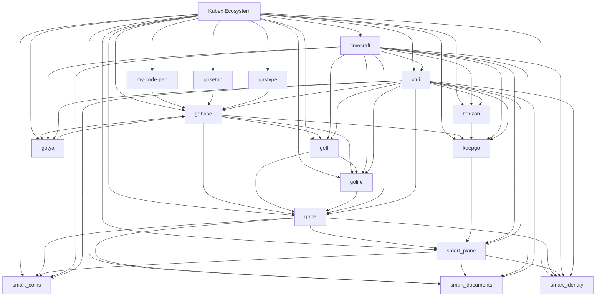

# Modules Reference Map

A high-level overview of the Kubex ecosystem and its modules. Each module is designed to be autonomous, lightweight, and useful, providing out-of-the-box functionality for various applications.

```plaintext
Kubex Ecosystem     # Autonomous, Lightweight, useful, portable, out-of-the-box, open source product family, entirely developed by me.

├── kubex-docs            # Documentation for the Kubex ecosystem, including guides, tutorials, and API references.
├── gobe                  # Go engine for KUBEX applications. Includes a robust backend, MCP (Model Context Protocol) for LLM/AI interactions, authentication, authorization, user management, and more.
├── gdbase                # Go library for dataService, container, and base utilities.
├── grompt                # Go library for prompt engineering and LLM (Large Language Model) interactions.
├── ghbex                 # Go library for interacting with GitHub, managing repositories, issues, pull requests, and more.
├── gastype               # Go library for AST type analysis and manipulation, go obfuscation, otimization, etc.
├── getl                  # Go library for ETL (Extract, Transform, Load) library.
├── kbxctl                # Go library for managing distributed systems and microservices. (e.g., Kubernetes, Docker, Helm, etc.)
├── golife                # Go library for all runtime life cycle management. (e.g., process, routines, threads, etc.)
├── gotya                 # Go library for web scraping and data extraction with a focus on ease of use and flexibility.
├── deeplook              # Go library for data scraping and processing from images using Google Gemini AI. It extracts structured information like name, brand, price, and more from images.
├── gocrafter             # Go library for code generation, scaffolding, project bootstrapping, building, managing, and sharing applications, services, tools, and more.
├── logz                  # Go library for structured logging, log management, log analysis, log monitoring, and log visualization.
├── xtui                  # Go library for building, managing, use, and sharing KUBEX UI components in Terminal applications. (CLI/Terminal UI/Core UI)
├── keepgo                # Go library for install and manage KUBEX services on all platforms. (e.g., Windows, Linux, MacOS)
├── smart_plane           # Go library for manage Hyperledger Fabric logic, state, transactions, and more.
├── smart_coins           # Go library for Smart contract for financial transactions and asset management.
├── smart_documents       # Go library for Smart contract for documents, approvals, and registrations management.
├── smart_identity        # Go library for Smart contract for identity and access management.
├── kortex                # React complete front-end framework for KUBEX MCP (Model Context Protocol) and LLM/AI applications management.
├── horizon               # Flutter/Dart dynamic front-end for KUBEX end-user applications.
├── timecraft-ai          # Python library for predictive time series analysis, forecasting, anomalies, and more.
├── byte_sleuth           # Python library for bytecode analysis and manipulation tools.
├── formatpilot           # Python library for conversion and transformation of texts between multiple formats (Markdown, LinkedIn, HTML, etc).
├── gosetup               # Go setup and configuration tools.
├── lookatni-file-markers # Go library for file marker management and manipulation, providing utilities for working with file markers with many out-of-the-box functionalities.
└── kbx-playground        # Personal code snippets and examples.
```

---

## Modules ORM

Each module in the Kubex ecosystem has been designed with ORM principles in mind, ensuring they are:

* **Independent but Composable** → Each module can operate independently, providing specific functionality but can also integrate seamlessly with other modules.
* **Interoperable and Extensible** → Modules can communicate and work together, allowing for the creation of complex systems while maintaining the ability to extend functionality as needed.
* **Robust and Maintainable** → Modules are designed with best practices in mind, ensuring they are robust, easy to maintain, and can evolve over time without breaking existing functionality.

Below is a reference diagram illustrating the relationships and interactions between the various modules in the Kubex ecosystem.



---

## Modules Interaction
